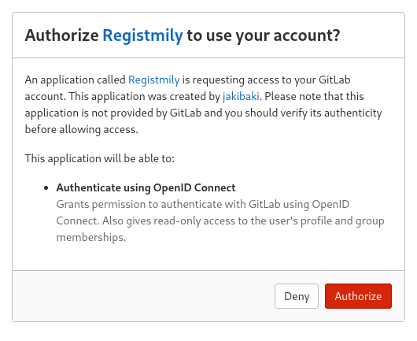

# Registmily, a cargo crate registry.

This is heavily work in progress!

## To do:

- [x] Basic cargo registry functionality
- [x] Session and ownership management using postgres + sqlx
- [x] OpenID Connect support for login
- [ ] System for pulling crates from crates.io and reviewing diffs

## Screenshots: 

